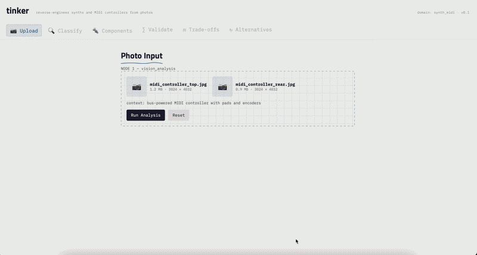

# tinker

**A generalizable agentic architecture for reverse-engineering physical products from photos.**

Upload images of a synthesizer or MIDI controller. tinker identifies components, estimates specs using visible parts as scale references, validates the full system against electrical and signal constraints, explains the engineering trade-offs the designers made, and suggests physics-validated alternative configurations.

The synth/MIDI domain is the first implementation. The architecture is designed so adding a new product domain (HVAC, e-bikes, 3D printers) requires only a new `DomainAdapter` — the orchestration graph, state schema, vision pipeline, and frontend are fully reusable.

---

## Demo



__

## How It Works

```
Photos + Context
      |
      v
[vision_analysis]       3 LLM passes: classify system, identify components, estimate spatial layout
      |
      v
[component_lookup]      Fuzzy-match identified parts against a curated JSON component database
      |
      v
[physics_validation]    First-order constraint checks (power budget, control latency, audio headroom)
      |    ^
      |    | invalid_fixable — retry with adjusted estimates (up to 2x)
      v    |
[tradeoff_analyzer]     LLM reasoning about why designers made specific choices
      |
      v
[alternative_suggester] LLM proposes modifications, each re-validated through the physics engine
      |
      v
[report_generator]      Compile structured engineering teardown
```

The pipeline is orchestrated as a **LangGraph `StateGraph`** with conditional edges — when physics validation fails with fixable issues, the graph loops back to component lookup rather than proceeding with inconsistent specs.

---

## What Makes This Technically Interesting

### Domain-agnostic graph with domain-specific physics

The `DomainAdapter` ABC is the only boundary between orchestration and domain logic. The graph calls abstract methods (`validate_physics`, `lookup_components`, `get_tradeoff_prompt`, etc.) without knowing whether it's analyzing a MIDI controller or an HVAC system. Adding a domain means implementing ~9 methods and seeding a component database — the graph, state schema, API, and frontend don't change.

### Physics-constrained suggestions (not just LLM opinions)

The `alternative_suggester` node doesn't just ask the LLM for ideas. It follows a 4-step process:

1. LLM proposes a modification (e.g., "swap LDO for buck regulator")
2. The suggestion is applied to a copy of the component list
3. `validate_physics()` is re-run on the modified configuration
4. Before/after metrics are compared — only suggestions where improvement is confirmed by the physics engine are surfaced

This means every suggestion in the output carries `validated: true` with concrete numbers (`new_usb_headroom_mA`, `new_estimated_total_current_mA`), not just LLM assertions.

### Self-correcting validation loop

The conditional edge after `physics_validation` implements a bounded retry:

- `valid` — proceed to trade-off analysis
- `invalid_fixable` — loop back to `component_lookup` with prior validation context (up to 2 retries)
- `invalid_fatal` — skip to report generation with error diagnostics

This means the agent can self-correct when vision-estimated specs don't close, rather than blindly proceeding with inconsistent numbers.

### Vision-based scale estimation

Rather than requiring a reference object in the photo, the system uses known component dimensions as scale anchors — USB-C receptacle width (8.94mm), 6.35mm jack outer diameter, standard encoder footprints. The spatial estimation pass infers panel dimensions, control spacing, and weight from these anchors.

### First-order electrical validation

The physics engine runs tractable first-order checks that catch real engineering issues:

- **Power budget**: Sum component currents against USB2 500mA budget, flag headroom < 100mA
- **Control latency**: Worst-case scan time + debounce + matrix scaling, warn if > 15ms for performance gear
- **Audio headroom**: Rail voltage → max RMS → dBu conversion, check against pro line level targets
- **MIDI compliance**: Flag missing optocoupler isolation on DIN-5 MIDI IN

These aren't simulations — they're the same back-of-envelope calculations a hardware engineer would do during design review, encoded as deterministic Python functions.

---

## Repo Structure

```
tinker/
  backend/
    tinker/
      graph.py                  # LangGraph StateGraph definition
      state.py                  # TinkerAnalysisState TypedDict
      domain.py                 # DomainAdapter ABC
      main.py                   # FastAPI server
      llm.py                    # Anthropic client + heuristic fallback
      run_store.py              # In-memory run store
      supabase_run_store.py     # Supabase persistence
      nodes/                    # Pipeline node functions
      domains/
        synth_midi/             # First domain implementation
          adapter.py            # SynthMidiDomainAdapter
          db/                   # Component JSON databases
          physics/              # Power, latency, audio validation
          prompts/              # LLM prompt templates
      db/
        lookup.py               # Fuzzy matching (SequenceMatcher)
    tests/
    supabase/schema.sql
  frontend/
    src/
      App.jsx                   # React notebook UI with progressive reveal
      lib/api.js                # API client
      styles.css                # Engineer's notebook theme
  docs/
    architecture.md
    adding-a-domain.md          # Guide for extending to new product domains
```
---

## API

| Method | Endpoint | Description |
|--------|----------|-------------|
| `POST` | `/api/v1/runs` | Create a run (multipart: `images`, optional `user_context`) |
| `GET` | `/api/v1/runs/{run_id}` | Poll run status + state |
| `GET` | `/api/v1/runs/{run_id}/trace` | Get execution trace events |
| `GET` | `/api/v1/runs/{run_id}/report` | Get final report (JSON) |
| `GET` | `/api/v1/runs/{run_id}/report.md` | Get final report (plain markdown) |

---

## Adding a New Domain

See [docs/adding-a-domain.md](docs/adding-a-domain.md) for a step-by-step guide. In short:

1. Create `domains/your_domain/` with adapter, DB, physics, and prompts
2. Implement `DomainAdapter` (~9 abstract methods)
3. Seed a component database (JSON files, 10-50 entries per category)
4. Write domain-specific physics validation checks
5. Write prompt templates for classification, component ID, spatial estimation, trade-offs, and alternatives

The graph, API, frontend, and state schema are reused unchanged.

---

## Tech Stack

| Layer | Technology |
|-------|-----------|
| Orchestration | LangGraph (`StateGraph` with conditional edges) |
| LLM | Claude API (vision + text) with structured JSON output |
| Physics | Python (first-order electrical/signal calculations) |
| Component DB | JSON files with fuzzy matching (`SequenceMatcher`) |
| Backend | FastAPI + async run execution |
| Frontend | React + Vite |
| Persistence | Supabase (optional) or in-memory |
